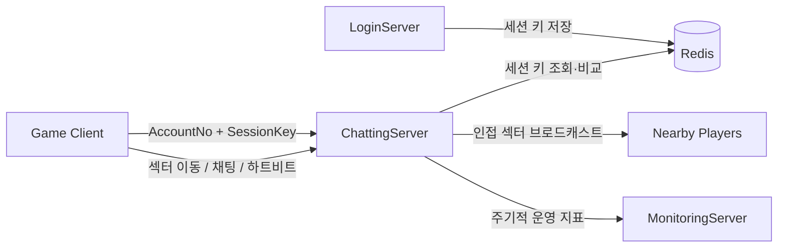

# ChattingServer

> 로그인 세션을 검증하고, 플레이어의 주변 섹터에 실시간 채팅을 전달하는 Windows IOCP 서버

`C++20` · `Windows` · `TCP / IOCP` · `Redis` · `Sector AOI` · `Server Monitoring`

## 프로젝트 한눈에 보기

| 항목 | 내용 |
|---|---|
| 역할 | 게임 서비스의 로그인 이후 채팅 채널 담당 |
| 핵심 흐름 | 세션 키 검증 → 플레이어 등록 → 섹터 이동 → 주변 채팅 브로드캐스트 |
| 네트워크 | Windows IOCP 기반 비동기 TCP 서버 |
| 공간 분할 | 50×50 섹터, 현재 섹터를 포함한 최대 3×3 인접 영역 전송 |
| 운영 지표 | CPU·메모리·세션·패킷 처리량을 MonitoringServer로 전달 |

## 서버 흐름

LoginServer가 Redis에 임시 세션 키를 기록하고, 로그인 연동 버전의 ChattingServer가 같은 키를 확인한 뒤 채팅 플레이어로 등록합니다.

## 핵심 구현

### 1. IOCP 네트워크 코어

- Accept·수신·송신 완료를 IOCP worker가 처리합니다.
- 세션별 ring buffer와 send queue, 직렬화 패킷, TLS object pool을 사용합니다.
- 패킷 경계와 세션 수명 코드는 [`NetServer.cpp`](IOCPChatServer_With_Login_Multi/NetServer.cpp)에서 확인할 수 있습니다.

### 2. 로그인 세션 검증

- 클라이언트의 `AccountNo`와 64-byte `SessionKey`를 Redis 값과 비교합니다.
- worker별 Redis 연결을 TLS로 재사용합니다.
- 현재 구현의 `syncGet`은 처리 경로를 막을 수 있어, 외부 I/O 격리는 후속 현대화 대상입니다.

### 3. 섹터 기반 채팅 AOI

- 플레이어를 섹터별 집합으로 관리하고 이동 시 소속 섹터를 갱신합니다.
- 채팅은 전체 접속자 대신 현재 위치 주변 섹터에만 전송합니다.
- 로그인·섹터 이동·메시지·하트비트 패킷은 [`Protocol.h`](IOCPChatServer_With_Login_Multi/Protocol.h)에 정의되어 있습니다.

### 4. 관측 가능성

- 별도 모니터링 스레드가 서버와 패킷 풀 상태를 집계합니다.
- [`MonitoringLanClient.cpp`](IOCPChatServer_With_Login_Multi/MonitoringLanClient.cpp)가 수집 서버와의 LAN 프로토콜을 담당합니다.

## 구현 변형

| 프로젝트 | 목적 |
|---|---|
| [`IOCPChatServer_NotLogin_Single`](IOCPChatServer_NotLogin_Single) | 외부 로그인 단계 없이 콘텐츠 job thread 흐름을 실험한 독립형 |
| [`IOCPChatServer_NotLogin_Multi`](IOCPChatServer_NotLogin_Multi) | 외부 로그인 단계 없이 다중 worker 흐름을 비교한 변형 |
| [`IOCPChatServer_With_Login_Single`](IOCPChatServer_With_Login_Single) | Redis 세션 검증을 포함한 단일 콘텐츠 thread 변형 |
| [`IOCPChatServer_With_Login_Multi`](IOCPChatServer_With_Login_Multi) | Redis 세션 검증을 포함한 다중 worker 변형 |

네 변형은 로그인 연동 여부와 처리 모델을 비교하며, 네트워크·패킷·풀 코드를 각각 보유한 레거시 구현입니다.

## 코드 탐색

| 경로 | 설명 |
|---|---|
| [`ChatServer.cpp`](IOCPChatServer_With_Login_Multi/ChatServer.cpp) | 로그인, 섹터 이동, 채팅, 하트비트 처리 |
| [`Sector.h`](IOCPChatServer_With_Login_Multi/Sector.h) | 섹터별 플레이어 집합과 동기화 경계 |
| [`Redis.cpp`](IOCPChatServer_With_Login_Multi/Redis.cpp) | cpp_redis 기반 세션 저장소 접근 |
| [`SerializingBuffer.cpp`](IOCPChatServer_With_Login_Multi/SerializingBuffer.cpp) | 패킷 직렬화·인코딩 |
| [`DummyClient`](IOCPChatServer_With_Login_Multi/DummyClient) | 채팅 부하·기능 확인용 클라이언트 자산 |

## 빌드 및 실행 전제

- Visual Studio 2022 toolset `v143`, Windows 10 SDK, C++20
- WinSock2, `cpp_redis`, `tacopie`; 로그인 연동형은 실행 중인 Redis 필요
- [`ChatServer.txt`](IOCPChatServer_With_Login_Multi/ChatServer.txt)의 bind·Redis·모니터링 설정을 환경에 맞게 교체
- 전체 흐름 확인 시 Redis → MonitoringServer → LoginServer → ChattingServer → Client 순서 권장

> 프로젝트 파일에는 번들 라이브러리와 과거 로컬 환경 흔적이 포함되어 있어 깨끗한 머신에서의 재현 빌드는 아직 검증하지 않았습니다.

## 현재 상태

이 저장소는 2024년 게임 서버 학습·포트폴리오의 레거시 기준선입니다. 세션 수명, 종료 순서, Redis blocking I/O, 입력 검증을 작은 단위로 재검증하는 현대화가 남아 있으며, 측정되지 않은 동시 접속자 수나 TPS는 주장하지 않습니다.

연계 저장소: [LoginServer](https://github.com/ldcity/LoginServer) · [MonitoringServer](https://github.com/ldcity/MonitoringServer)
